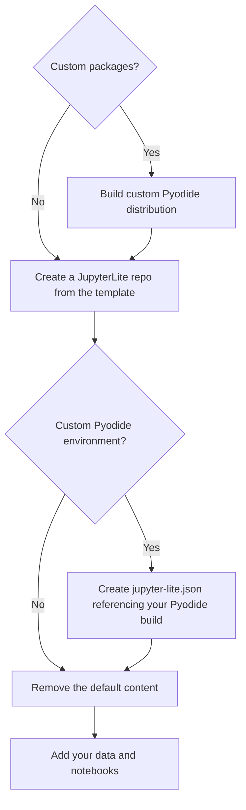

# Custom JupyterLite Environment

- [Workflow](#workflow)
- [Steps](#steps)

## Workflow



## Steps

1. Create a new repo using the [JupyterLite template repository](https://github.com/jupyterlite/demo). Follow [the instructions](https://jupyterlite.readthedocs.io/en/latest/quickstart/deploy.html) to make sure the GitHub Pages build process is set up and creating your new JupyterLite site.
2. If you created or are using a custom Pyodide build, create a `jupyter-lite.json` configuration file at the top level of your new repository (see [the example in this repo](jupyter-lite.json)), e.g.,
```json
{
  "jupyter-lite-schema-version": 0,
  "jupyter-config-data": {
    "litePluginSettings": {
      "@jupyterlite/pyodide-kernel-extension:kernel": {
        "pyodideUrl": "https://<your github pages domain?/pyodide-ext/pyodide.js"
      }
    }
  }
}
```
3. Update the notebooks and data in the [content](./content/) folder. Remove the sample notebooks and data you don't need, and add your own.
